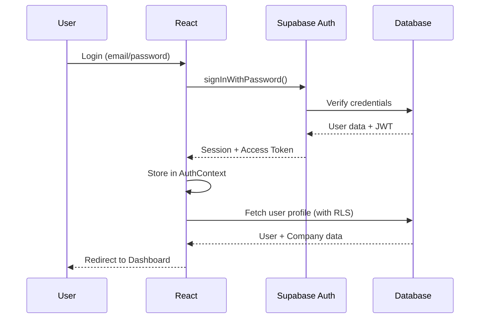
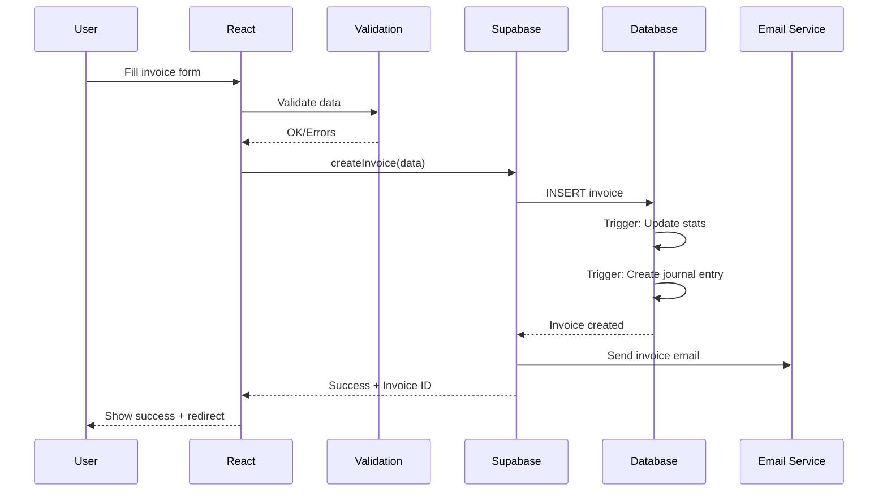

# 🏗️ Architecture CassKai

**Version**: 1.0  
**Dernière mise à jour**: Janvier 2025  
**Status**: ✅ Production-Ready

---

## 📋 Table des Matières

- [Vue d'Ensemble](#vue-densemble)
- [Architecture Frontend](#architecture-frontend)
- [Architecture Backend](#architecture-backend)
- [Flux de Données](#flux-de-données)
- [Modules Principaux](#modules-principaux)
- [Sécurité](#sécurité)
- [Performance](#performance)
- [Scalabilité](#scalabilité)

---

## 🎯 Vue d'Ensemble

CassKai est construit avec une **architecture moderne en couches** optimisée pour la maintenabilité, la performance et la scalabilité.

### Principes Architecturaux

1. **Séparation des préoccupations** : UI, logique métier, et données
2. **Composants réutilisables** : DRY (Don't Repeat Yourself)
3. **Type-safety** : TypeScript strict partout
4. **Performance-first** : Code splitting, lazy loading, memoization
5. **Security-by-design** : Authentification, autorisation, validation

---

## 🎨 Architecture Frontend

### Structure des Dossiers

```
src/
├── components/           # Composants React
│   ├── ui/              # Composants UI de base (buttons, cards, etc.)
│   ├── accounting/      # Modules comptabilité
│   ├── invoicing/       # Modules facturation
│   ├── crm/             # Modules CRM
│   ├── dashboard/       # Dashboards et analytics
│   └── layout/          # Layout et navigation
│
├── pages/               # Pages principales (routes)
│   ├── Dashboard.tsx
│   ├── AccountingPage.tsx
│   ├── InvoicesPage.tsx
│   └── ...
│
├── hooks/               # Custom React hooks
│   ├── useAuth.ts       # Authentification
│   ├── useToast.ts      # Notifications
│   ├── useSupabase.ts   # Client Supabase
│   └── ...
│
├── contexts/            # React Context API
│   ├── AuthContext.tsx  # État authentification
│   ├── ThemeContext.tsx # Thème (light/dark)
│   └── ...
│
├── services/            # Logique métier et API
│   ├── api/            # Clients API
│   ├── accounting/     # Services comptables
│   ├── invoicing/      # Services facturation
│   └── ...
│
├── types/              # Définitions TypeScript
│   ├── database.types.ts
│   ├── api.types.ts
│   └── ...
│
└── utils/              # Utilitaires
    ├── formatters.ts   # Formatage dates, montants
    ├── validators.ts   # Validation de données
    └── ...
```

### Stack Frontend

**Framework UI**
- **React 18.3** - Rendu déclaratif avec Concurrent Features
- **TypeScript 5.3** - Type safety et DX améliorée
- **Vite 5.0** - Build ultra-rapide (HMR < 100ms)

**Styling**
- **TailwindCSS 3.4** - Utility-first CSS
- **Shadcn/ui** - Composants accessibles et customisables
- **Lucide React** - Icônes SVG optimisées

**État & Data Fetching**
- **React Query (TanStack Query)** - Server state management
- **Zustand** - Client state (léger, simple)
- **React Context** - État global application

**Routing**
- **React Router v6** - Client-side routing
- **Code splitting** - Lazy loading par route

---

## 🔧 Architecture Backend

### ⚠️ Configuration Actuelle (Déploiement)

**VPS Production (casskai.app)**
- **Frontend uniquement** : Nginx sert les fichiers statiques React
- **Backend** : Supabase (DB + Auth + Storage + Edge Functions)
- **Stripe Checkout** : Via Supabase Edge Functions (Deno serverless)
- **PM2** : Aucun service actif (pas de serveur Node.js)

**Architecture déployée**
```
┌─────────────┐
│   Browser   │
└──────┬──────┘
       │ HTTPS
┌──────▼────────────┐
│  Nginx (VPS)      │  Port 8080
│  casskai.app      │  Serve static files
└──────┬────────────┘
       │
┌──────▼────────────┐
│  React App        │  Built with Vite
│  (Frontend)       │  SPA with routing
└──────┬────────────┘
       │
       ├─────────────── Supabase JS SDK
       │
┌──────▼────────────────────────┐
│   Supabase Cloud              │
│                               │
│  ┌─────────────────────────┐ │
│  │ PostgreSQL Database     │ │
│  │ (Auth + Storage + RLS)  │ │
│  └─────────────────────────┘ │
│                               │
│  ┌─────────────────────────┐ │
│  │ Edge Functions (Deno)   │ │
│  │ ├─ create-checkout      │ │◄── Stripe API
│  │ └─ (autres fonctions)   │ │
│  └─────────────────────────┘ │
└───────────────────────────────┘
```

**Note importante** : Le répertoire `backend/` (Node.js/Express) existe mais **N'EST PAS UTILISÉ**. Voir `backend/README-NOT-USED.md` pour plus de détails.

### Supabase (Backend as a Service)

**PostgreSQL Database**
```sql
-- Structure principale
├── public schema
│   ├── companies         -- Entreprises
│   ├── users             -- Utilisateurs
│   ├── invoices          -- Factures
│   ├── journal_entries   -- Écritures comptables
│   ├── accounts          -- Plan comptable
│   ├── clients           -- Clients CRM
│   └── ...
```

**Row Level Security (RLS)**
```sql
-- Exemple RLS sur invoices
CREATE POLICY "Users can view their company invoices"
ON invoices
FOR SELECT
USING (
  company_id IN (
    SELECT company_id FROM user_companies 
    WHERE user_id = auth.uid()
  )
);
```

**Fonctions RPC**
- `get_company_dashboard(company_id)` - Dashboard data aggregation
- `generate_financial_report(...)` - Génération rapports
- `auto_categorize_transaction(...)` - Catégorisation IA

**Triggers & Automation**
```sql
-- Exemple: Update company stats on invoice change
CREATE TRIGGER update_company_stats
AFTER INSERT OR UPDATE OR DELETE ON invoices
FOR EACH ROW
EXECUTE FUNCTION refresh_company_statistics();
```

### Services Externes

**OpenAI GPT-4**
- Assistant IA conversationnel
- Catégorisation intelligente
- Analyse de documents

**Stripe**
- Paiements par carte
- Gestion abonnements
- Webhooks pour événements

**Resend**
- Emails transactionnels
- Templates professionnels
- Tracking et analytics

---

## 🔄 Flux de Données

### Authentification Flow



### Invoice Creation Flow



### Real-time Updates

```typescript
// Subscription temps réel aux changements
const subscription = supabase
  .channel('invoices_changes')
  .on(
    'postgres_changes',
    {
      event: '*',
      schema: 'public',
      table: 'invoices',
      filter: `company_id=eq.${companyId}`
    },
    (payload) => {
      // Update UI en temps réel
      queryClient.invalidateQueries(['invoices']);
    }
  )
  .subscribe();
```

---

## 📦 Modules Principaux

### Module Comptabilité

**Composants clés**
- `ChartOfAccounts` - Plan comptable PCG
- `JournalEntryForm` - Saisie écritures
- `FECImport` - Import fichiers FEC
- `FinancialReports` - Rapports financiers

**Services**
- `accountingService.ts` - CRUD comptes
- `journalService.ts` - Gestion écritures
- `fecImportService.ts` - Import/validation FEC
- `reportGenerationService.ts` - Génération rapports

**Hooks personnalisés**
- `useAccounts()` - Gestion plan comptable
- `useJournalEntries()` - Écritures avec pagination
- `useFECImport()` - Import workflow

### Module Facturation

**Composants clés**
- `InvoiceForm` - Création/édition factures
- `InvoiceList` - Liste avec filtres
- `InvoicePreview` - Aperçu PDF
- `PaymentTracking` - Suivi paiements

**Services**
- `invoiceService.ts` - CRUD factures
- `pdfGenerationService.ts` - PDF professionnels
- `emailService.ts` - Envoi emails
- `paymentService.ts` - Gestion paiements

### Module CRM

**Composants clés**
- `ClientsList` - Gestion clients
- `OpportunityPipeline` - Pipeline visuel
- `ActivityTimeline` - Historique interactions

**Services**
- `crmService.ts` - CRUD clients/opportunités
- `activityService.ts` - Tracking activités

### Module IA

**Composants clés**
- `AIAssistantChat` - Chat interface
- `AIInsightsDashboard` - Insights prédictifs
- `SmartCategorization` - Auto-catégorisation

**Services**
- `OpenAIService.ts` - Intégration GPT-4
- `predictiveAnalyticsService.ts` - ML prédictions

---

## 🔐 Sécurité

### Couches de Sécurité

**1. Authentification**
```typescript
// JWT tokens gérés par Supabase
// Refresh automatique des tokens
// Session persistence sécurisée
```

**2. Autorisation (RLS)**
```sql
-- Row Level Security sur toutes les tables
-- Utilisateur ne voit que ses données entreprise
-- Policies basées sur les rôles
```

**3. Validation**
```typescript
// Validation Zod côté client
const InvoiceSchema = z.object({
  amount: z.number().positive(),
  clientId: z.string().uuid(),
  // ...
});

// Validation serveur (Supabase functions)
```

**4. HTTPS & Headers**
```nginx
# Nginx config
add_header Strict-Transport-Security "max-age=31536000";
add_header X-Frame-Options "SAMEORIGIN";
add_header X-Content-Type-Options "nosniff";
add_header Content-Security-Policy "...";
```

### Audit & Logging

```typescript
// Tous les changements critiques sont loggés
await auditLog.log({
  action: 'invoice.delete',
  userId: user.id,
  resourceId: invoice.id,
  ipAddress: request.ip,
  changes: { ... }
});
```

---

## ⚡ Performance

### Optimisations Frontend

**1. Code Splitting**
```typescript
// Lazy loading par route
const AccountingPage = lazy(() => import('./pages/AccountingPage'));
const InvoicesPage = lazy(() => import('./pages/InvoicesPage'));
```

**2. Memoization**
```typescript
// React.memo pour éviter re-renders
export const InvoiceCard = React.memo(({ invoice }) => {
  // ...
});

// useMemo pour calculs coûteux
const totalAmount = useMemo(() => 
  items.reduce((sum, item) => sum + item.total, 0),
  [items]
);
```

**3. Virtual Scrolling**
```typescript
// Pour listes > 100 éléments
<VirtualList
  items={invoices}
  itemHeight={80}
  renderItem={(invoice) => <InvoiceCard {...invoice} />}
/>
```

**4. Image Optimization**
```typescript
// Lazy loading images


// WebP avec fallback
<picture>
  <source srcSet="image.webp" type="image/webp" />
  
</picture>
```

### Optimisations Backend

**1. Indexes Database**
```sql
-- Index sur requêtes fréquentes
CREATE INDEX idx_invoices_company_date 
ON invoices(company_id, created_at DESC);

CREATE INDEX idx_journal_entries_account 
ON journal_entries(account_id);
```

**2. Query Optimization**
```sql
-- Éviter N+1 queries
-- Utiliser JOINs appropriés
-- EXPLAIN ANALYZE pour profiling
```

**3. Caching**
```typescript
// React Query cache automatique
// Stale-while-revalidate
const { data } = useQuery({
  queryKey: ['invoices', companyId],
  queryFn: fetchInvoices,
  staleTime: 5 * 60 * 1000, // 5 min
});
```

---

## 📈 Scalabilité

### Stratégie de Scale

**Horizontal Scaling**
- Load balancer Nginx
- Multiple instances PM2
- Database read replicas (Supabase)

**Vertical Scaling**
- Optimisation queries
- Caching agressif
- CDN pour assets

**Monitoring**
```typescript
// Performance monitoring
performance.measure('invoiceCreation', 'start', 'end');

// Error tracking (à venir: Sentry)
Sentry.captureException(error);
```

### Limites Actuelles

- **Users concurrent**: ~1000 (testé)
- **Database size**: Illimité (Supabase)
- **File storage**: 100GB (Supabase)
- **API requests**: 50k/jour

### Plan de Scale

**Phase 1** (0-1k users) ✅
- Architecture actuelle suffisante
- Monitoring basique

**Phase 2** (1k-10k users)
- Ajouter CDN Cloudflare
- Sentry monitoring
- Database connection pooling

**Phase 3** (10k-100k users)
- Microservices sélectifs
- Redis cache layer
- Queues pour jobs longs

---

## 📚 Patterns & Best Practices

### React Patterns

**Compound Components**
```typescript
<Tabs defaultValue="invoices">
  <TabsList>
    <TabsTrigger value="invoices">Factures</TabsTrigger>
    <TabsTrigger value="quotes">Devis</TabsTrigger>
  </TabsList>
  <TabsContent value="invoices">...</TabsContent>
</Tabs>
```

**Render Props**
```typescript
<DataTable
  data={invoices}
  renderRow={(invoice) => <InvoiceRow {...invoice} />}
  renderEmpty={() => <EmptyState />}
/>
```

**Custom Hooks**
```typescript
// Encapsule logique réutilisable
function useInvoices(companyId: string) {
  const query = useQuery(['invoices', companyId], fetchInvoices);
  const create = useMutation(createInvoice);
  
  return {
    invoices: query.data,
    isLoading: query.isLoading,
    createInvoice: create.mutate,
  };
}
```

---

## 🔄 Migration & Évolution

### Database Migrations

```bash
# Créer migration
supabase migration new add_payment_method

# Appliquer migrations
supabase db push

# Rollback
supabase db reset
```

### Breaking Changes

Processus pour changements majeurs:
1. **Deprecation warning** (1 version)
2. **Dual support** (1 version)
3. **Removal** (version suivante)

---

## 📞 Support Architecture

Questions architecture : architecture@casskai.app  
Pull requests : Suivre [CONTRIBUTING.md](CONTRIBUTING.md)

---

<div align="center">

**Architecture maintenue par l'équipe CassKai**

[Retour README](README.md) • [Deployment Guide](DEPLOYMENT.md)

</div>
