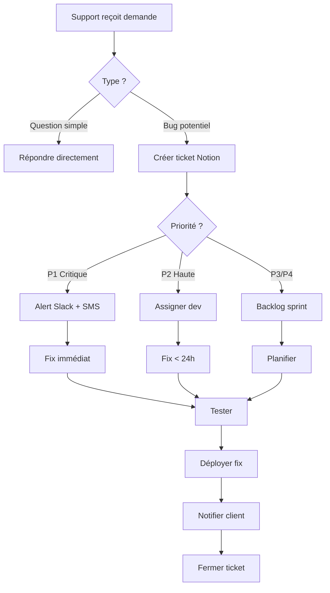

# 💬 Configuration Support Client - CassKai Beta

Guide complet pour mettre en place le support client avec chat en direct, FAQ, et processus d'escalation.

---

## 📋 Vue d'ensemble

Système de support multi-canal pour la phase Beta :

1. **Chat en direct** : Crisp.chat (gratuit jusqu'à 2 agents)
2. **FAQ page** : 23 questions couvrant 7 catégories
3. **Email** : support@casskai.com
4. **Téléphone** : +33 7 52 02 71 98
5. **Escalation** : Notion board pour tracking bugs

**Objectif Beta** : Réponse < 24h (< 2h pour plans Pro/Enterprise)

---

## 💬 Étape 1 : Configurer Crisp.chat

### A. Créer le compte

1. Aller sur [crisp.chat](https://crisp.chat/en/)
2. Cliquer "Try Crisp Free" (plan gratuit jusqu'à 2 agents)
3. **Email** : support@casskai.com
4. **Password** : Utiliser un mot de passe fort
5. **Company name** : CassKai
6. **Website** : https://casskai.fr

### B. Personnaliser le widget

1. Dans Crisp dashboard, aller dans **Settings** → **Website Settings**
2. **Website name** : CassKai Support
3. **Website URL** : https://casskai.fr
4. **Domain** : casskai.fr

#### Apparence du widget :

1. **Settings** → **Chatbox**
2. **Theme color** : `#3b82f6` (bleu CassKai)
3. **Position** : Bottom Right
4. **Widget text** : "Besoin d'aide ? 💬"
5. **Welcome message** :
   ```
   👋 Bonjour ! Je suis l'équipe CassKai.
   
   Comment puis-je vous aider aujourd'hui ?
   
   💡 Questions fréquentes : /faq
   📧 Email : support@casskai.com
   ⏱️ Horaires : Lun-Ven 9h-18h CET
   ```

#### Messages automatiques :

1. **Away message** (hors horaires) :
   ```
   🌙 Nous sommes actuellement hors ligne.
   
   Nos horaires : Lun-Ven 9h-18h (heure de Paris).
   
   Laissez-nous un message, nous vous répondrons dès notre retour (< 24h).
   
   Urgent ? Envoyez un email à support@casskai.com
   ```

2. **Waiting message** (si délai > 2 min) :
   ```
   ⏳ Merci de patienter, nous consultons votre demande...
   
   En attendant :
   - Consultez notre FAQ : https://casskai.fr/faq
   - Vérifiez le statut système : https://casskai.fr/system-status
   ```

### C. Installer le widget sur CassKai

#### Option 1 : Script Crisp (recommandé)

Ajouter dans `index.html` avant `</head>` :

```html
<!-- Crisp Chat Widget -->
<script type="text/javascript">
  window.$crisp = [];
  window.CRISP_WEBSITE_ID = "VOTRE_CRISP_WEBSITE_ID"; // À récupérer depuis Crisp dashboard
  (function() {
    d = document;
    s = d.createElement("script");
    s.src = "https://client.crisp.chat/l.js";
    s.async = 1;
    d.getElementsByTagName("head")[0].appendChild(s);
  })();
</script>
```

**⚠️ Remplacer `VOTRE_CRISP_WEBSITE_ID`** par votre ID (format : `xxxxxxxx-xxxx-xxxx-xxxx-xxxxxxxxxxxx`)

Trouver votre Website ID :
1. Crisp dashboard → **Settings** → **Website Settings**
2. Copier le **Website ID** affiché en haut

#### Option 2 : Variable d'environnement (plus propre)

1. Ajouter à `.env.production` :
   ```bash
   VITE_CRISP_WEBSITE_ID=votre-crisp-website-id
   ```

2. Modifier `index.html` :
   ```html
   <script type="text/javascript">
     window.$crisp = [];
     window.CRISP_WEBSITE_ID = import.meta.env.VITE_CRISP_WEBSITE_ID || "fallback-id";
     (function() {
       d = document;
       s = d.createElement("script");
       s.src = "https://client.crisp.chat/l.js";
       s.async = 1;
       d.getElementsByTagName("head")[0].appendChild(s);
     })();
   </script>
   ```

### D. Configuration avancée

#### Horaires d'ouverture :

1. **Settings** → **Availability**
2. **Timezone** : Europe/Paris
3. **Opening hours** :
   - Lundi-Vendredi : 9:00 - 18:00
   - Samedi-Dimanche : Fermé
4. Activer "Show availability status"

#### Notifications :

1. **Settings** → **Notifications**
2. Activer :
   - ✅ Email notifications (support@casskai.com)
   - ✅ Desktop notifications (pour agents connectés)
   - ✅ Mobile push (installer app Crisp sur smartphone)
3. **Email digest** : Désactiver (notifications immédiates uniquement)

#### Canned responses (réponses prédéfinies) :

Créer dans **Settings** → **Canned Responses** :

1. **Reset password** (raccourci : `/password`) :
   ```
   Pour réinitialiser votre mot de passe :
   1. Allez sur la page de connexion
   2. Cliquez "Mot de passe oublié ?"
   3. Entrez votre email
   4. Cliquez sur le lien reçu par email (valide 1h)
   
   Si vous ne recevez pas l'email, vérifiez vos spams.
   ```

2. **Import FEC** (raccourci : `/fec`) :
   ```
   Pour importer un fichier FEC :
   1. Comptabilité > Importer
   2. Choisir "FEC"
   3. Sélectionner votre fichier (.txt ou .xml, max 50 Mo)
   4. Valider
   
   Guide complet : https://casskai.fr/faq (catégorie Comptabilité)
   ```

3. **Pricing** (raccourci : `/tarifs`) :
   ```
   Nos tarifs Beta :
   - Starter : 39€/mois (1 entreprise, 50 factures/mois)
   - Pro : 89€/mois (3 entreprises, illimité)
   - Enterprise : 159€/mois (illimité + API + support prioritaire)
   
   Offre early adopters : -25% = 29€/mois (100 premiers) 🎉
   
   Voir : https://casskai.fr/pricing
   ```

4. **RGPD export** (raccourci : `/export`) :
   ```
   Pour exporter vos données personnelles (RGPD) :
   1. Mon Compte > Confidentialité
   2. Cliquer "Demander mes données"
   3. Vous recevrez un email avec le lien de téléchargement (< 48h)
   
   Le fichier JSON contient toutes vos données.
   ```

#### Chatbot automatique (optionnel) :

1. **Settings** → **Chatbot**
2. Créer un scénario "First contact" :
   - **Trigger** : Nouvelle conversation
   - **Message** : "Pour vous aider plus rapidement, choisissez votre sujet :"
   - **Options** :
     - 🔐 Problème de connexion → `/password`
     - 📊 Question comptabilité → `/fec`
     - 💳 Tarifs et abonnements → `/tarifs`
     - 🛡️ Données RGPD → `/export`
     - 💬 Autre question → Contact agent

---

## ❓ Étape 2 : Page FAQ (déjà créée)

La page `/faq` contient **23 questions** réparties en **7 catégories** :

### Catégories :

1. **Général** (4 questions)
   - Qu'est-ce que CassKai ?
   - Remplacement expert-comptable ?
   - Sécurité des données
   - Essai gratuit

2. **Compte & Connexion** (3 questions)
   - Créer compte
   - Mot de passe oublié
   - Multi-entreprises

3. **Comptabilité** (4 questions)
   - Import écritures
   - Personnaliser plan comptable
   - Export FEC
   - TVA automatique

4. **Facturation** (3 questions)
   - Créer/envoyer facture
   - Personnaliser template
   - Numérotation conforme

5. **RGPD & Confidentialité** (3 questions)
   - Droit d'accès données
   - Supprimer compte
   - Cookies publicitaires

6. **Abonnement & Paiement** (3 questions)
   - Tarifs et paiements
   - Changer de plan
   - Annuler abonnement

7. **Technique & Support** (3 questions)
   - Mobile/tablette
   - Compatibilité navigateurs
   - Contacter support

### Fonctionnalités de la FAQ :

- ✅ Recherche en temps réel (question + réponse + mots-clés)
- ✅ Filtres par catégorie
- ✅ Accordéons expand/collapse
- ✅ Contact support en bas de page (chat, email, téléphone)
- ✅ Liens rapides vers documents légaux, roadmap, RGPD

### Ajouter/modifier des questions :

Modifier `src/pages/FAQPage.tsx` dans l'array `faqData` :

```typescript
{
  id: 'unique-id',
  category: 'general', // ou autre catégorie
  question: 'Votre question ?',
  answer: 'Votre réponse détaillée avec sauts de ligne si nécessaire.',
  keywords: ['mot1', 'mot2', 'mot3'] // Pour la recherche
}
```

---

## 📧 Étape 3 : Configurer l'email support@casskai.com

### Option 1 : Gmail professionnel (recommandé)

#### A. Créer l'alias Gmail

Si vous avez un compte Gmail existant (ex: contact@casskai.com) :

1. Gmail → **Paramètres** (⚙️) → **Comptes et importation**
2. **Envoyer des e-mails en tant que** → "Ajouter une autre adresse e-mail"
3. **Nom** : CassKai Support
4. **Adresse e-mail** : support@casskai.com
5. **Traiter comme un alias** : Cocher
6. Valider avec le lien reçu

#### B. Configurer les filtres automatiques

Créer un filtre pour tagger les emails de support :

1. Gmail → Rechercher : `to:support@casskai.com`
2. Créer un filtre basé sur cette recherche
3. **Appliquer un libellé** : "Support Client"
4. **Marquer comme important** : Oui
5. **Ne jamais envoyer dans spam** : Oui
6. Créer le filtre

#### C. Réponses automatiques

Pour les absences (vacances, weekends) :

1. Gmail → **Paramètres** → **Réponse automatique**
2. **Activer** durant la période d'absence
3. **Message** :
   ```
   Bonjour,
   
   Merci pour votre message.
   
   Notre équipe support est actuellement indisponible. Nous vous répondrons dès notre retour (< 24h).
   
   Pour une aide immédiate :
   - FAQ : https://casskai.fr/faq
   - Chat en direct : https://casskai.fr (icône en bas à droite)
   - Statut système : https://casskai.fr/system-status
   
   Cordialement,
   L'équipe CassKai
   ```

### Option 2 : Redirection vers Gmail

Si support@casskai.com n'existe pas encore :

1. Configurer une redirection DNS :
   - Type : MX Record
   - Name : support
   - Value : 1 ASPMX.L.GOOGLE.COM
   - TTL : 1h

2. Vérifier le domaine dans Gmail (voir docs Google)

---

## 📱 Étape 4 : Support téléphonique

**Numéro** : +33 7 52 02 71 98

### Configuration du répondeur :

```
Bonjour, vous êtes bien chez CassKai.

Pour le support client, tapez 1.
Pour les ventes, tapez 2.
Pour toute autre demande, laissez un message.

Nos horaires : du lundi au vendredi, de 9h à 18h, heure de Paris.
```

### Script d'appel support :

**Accueil** (< 15 secondes) :
```
Bonjour, [Prénom] de CassKai, comment puis-je vous aider ?
```

**Qualification** (1-2 min) :
- Quel est votre problème ?
- Avez-vous reçu des messages d'erreur ?
- Depuis quand rencontrez-vous ce souci ?
- Quel est votre email de compte ?

**Résolution** :
- Si résolvable immédiatement → Guider étape par étape
- Si nécessite investigation → "Je vais creuser ça et vous recontacter sous 2h par email"
- Si bug confirmé → Créer ticket Notion + numéro de suivi

**Clôture** (< 30 secondes) :
```
Parfait, est-ce que je peux faire autre chose pour vous aujourd'hui ?
[Si non] Je vous souhaite une excellente journée, merci d'avoir choisi CassKai !
```

**KPI téléphone** :
- Temps moyen d'appel : < 5 min
- Résolution premier contact : > 70%
- Satisfaction : > 85%

---

## 🐛 Étape 5 : Process Escalation Bugs

### A. Créer le Notion board

1. Créer un compte [Notion](https://notion.so) (gratuit)
2. Créer une nouvelle page : "CassKai - Support Tracker"
3. Ajouter une base de données "Tickets Support"

#### Colonnes du board :

| Colonne | Type | Options |
|---------|------|---------|
| **Ticket ID** | Titre | Auto-généré (ex: #001) |
| **Statut** | Select | Nouveau, En cours, Résolu, Fermé |
| **Priorité** | Select | Critique (P1), Haute (P2), Moyenne (P3), Basse (P4) |
| **Type** | Select | Bug, Question, Feature Request, Amélioration |
| **Utilisateur** | Email | Email du client |
| **Description** | Texte long | Détails du problème |
| **Steps to Reproduce** | Texte long | Étapes pour reproduire |
| **Browser/OS** | Texte court | Chrome 120 / Windows 11 |
| **Screenshot** | Fichier | Capture d'écran |
| **Assigné à** | Person | Aldric, Tech Team |
| **Créé le** | Date | Auto |
| **Résolu le** | Date | Manuel |
| **Temps de résolution** | Formula | Résolu le - Créé le |

#### Vues du board :

1. **Kanban par statut** : Nouveau → En cours → Résolu → Fermé
2. **Liste par priorité** : Trier P1 → P4
3. **Calendrier** : Par date de création
4. **Timeline** : Vue chronologique

### B. Niveaux de priorité

#### P1 - Critique (résolution < 2h)
- Application inaccessible (erreur 500)
- Perte de données
- Faille de sécurité
- Paiement bloqué

**Action** : Notifier immédiatement l'équipe tech via Slack/SMS

#### P2 - Haute (résolution < 24h)
- Fonctionnalité majeure cassée (export FEC, création facture)
- Bug bloquant pour un client payant
- Erreur affichée à tous les users

**Action** : Assigner à un dev, créer fix dans la journée

#### P3 - Moyenne (résolution < 7j)
- Bug mineur (affichage incorrect, lenteur)
- Amélioration UX demandée
- Question technique complexe

**Action** : Planifier dans le sprint suivant

#### P4 - Basse (résolution < 30j)
- Demande de fonctionnalité future
- Bug cosmétique (padding, couleur)
- Suggestion générale

**Action** : Ajouter au backlog, voter sur roadmap

### C. Workflow d'escalation



### D. Template de ticket Notion

Quand créer un ticket depuis Crisp/Email :

1. Copier ce template dans Notion :

```markdown
# Ticket #[AUTO]

## 📝 Résumé
[Description courte du problème en 1 phrase]

## 👤 Utilisateur
- Email : user@example.com
- Plan : Starter / Pro / Enterprise
- Compte créé le : [date]

## 🐛 Détails du bug
[Description détaillée du problème]

## 🔄 Steps to Reproduce
1. [Étape 1]
2. [Étape 2]
3. [Étape 3]
4. [Résultat observé]

## ✅ Comportement attendu
[Ce qui devrait se passer normalement]

## 🖥️ Environnement
- Browser : Chrome 120 / Firefox 115 / Safari 17
- OS : Windows 11 / macOS 14 / Ubuntu 22.04
- Résolution : 1920x1080
- Device : Desktop / Mobile / Tablette

## 📸 Screenshots
[Joindre captures d'écran]

## 🔗 URLs concernées
- https://casskai.fr/...

## 💬 Historique des échanges
[Coller l'historique Crisp ou emails]

## 🛠️ Solution proposée
[À remplir par le dev]

## ✅ Tests effectués
[À remplir après fix]

## 📊 Impact
- Utilisateurs affectés : X
- Fréquence : Rare / Fréquent / Systématique
- Workaround disponible : Oui/Non
```

---

## 📊 Étape 6 : Métriques de Support

### KPIs à suivre (Dashboard Notion)

1. **Volume de tickets**
   - Total par semaine
   - Par type (Bug / Question / Feature)
   - Par priorité

2. **Temps de réponse**
   - Premier contact : Cible < 5 min (chat) / < 2h (email)
   - Résolution : Cible < 24h (P2) / < 2h (P1)

3. **Satisfaction client**
   - Note post-support (1-5 étoiles dans Crisp)
   - Cible : > 4.5/5

4. **Taux de résolution**
   - Premier contact : Cible > 60%
   - Total : Cible > 95%

5. **Channels les plus utilisés**
   - Chat vs Email vs Téléphone
   - Optimiser ressources selon usage

### Rapport hebdomadaire

Tous les lundis matin, envoyer à l'équipe :

```
📊 Rapport Support S[XX] - 2025

🎫 Tickets
- Ouverts : X
- Résolus : Y
- En cours : Z
- P1 critiques : A

⏱️ Temps de réponse
- Moyen : Xh
- Premier contact : Ymin

⭐ Satisfaction
- Note moyenne : X.X/5
- Compliments : Y
- Réclamations : Z

🔝 Top 3 des problèmes
1. [Problème #1] - X tickets
2. [Problème #2] - Y tickets
3. [Problème #3] - Z tickets

💡 Actions à prendre
- [ ] [Action 1]
- [ ] [Action 2]
```

---

## ✅ Checklist de Lancement Beta

Avant le 10 décembre :

**Crisp.chat** :
- [ ] Compte créé et widget installé sur production
- [ ] Couleurs et branding configurés
- [ ] Messages automatiques (away, waiting) activés
- [ ] Horaires définis (Lun-Ven 9h-18h)
- [ ] 5 canned responses créées
- [ ] Notifications email + mobile activées
- [ ] Chatbot "First contact" configuré
- [ ] Widget testé sur desktop + mobile

**FAQ Page** :
- [ ] 23 questions validées et relues
- [ ] Recherche testée (10 mots-clés)
- [ ] Filtres par catégorie fonctionnels
- [ ] Liens vers legal/roadmap/gdpr actifs
- [ ] Contact support visible en bas de page

**Email** :
- [ ] support@casskai.com configuré et testé
- [ ] Redirection vers Gmail active
- [ ] Filtres et libellés créés
- [ ] Réponse automatique hors horaires
- [ ] Signature email avec logo

**Téléphone** :
- [ ] Numéro +33 7 52 02 71 98 actif
- [ ] Répondeur personnalisé configuré
- [ ] Script d'appel imprimé et à portée
- [ ] Casque/micro testé

**Notion Board** :
- [ ] Board "Support Tracker" créé
- [ ] 10 colonnes configurées
- [ ] 3 vues (Kanban, Liste, Calendrier)
- [ ] Template de ticket prêt à copier
- [ ] Accès partagé avec l'équipe

**Processus** :
- [ ] Workflow d'escalation documenté
- [ ] Niveaux de priorité définis
- [ ] SLA de résolution communiqués
- [ ] Alertes Slack pour P1 critiques
- [ ] Rapport hebdomadaire automatisé (lundi matin)

---

## 🆘 Troubleshooting

### Widget Crisp ne s'affiche pas

**Causes** :
1. ❌ Website ID incorrect → Vérifier dans Crisp dashboard
2. ❌ Adblocker bloque le script → Tester en navigation privée
3. ❌ CSP bloque Crisp → Ajouter exception (voir docs Crisp)

**Solution** :
Ouvrir DevTools → Console → Chercher erreurs `crisp`

### Emails support@ pas reçus

**Causes** :
1. ❌ Redirection DNS mal configurée → Vérifier MX records
2. ❌ Gmail filtre comme spam → Vérifier dossier spam
3. ❌ Sender non vérifié → Vérifier SPF/DKIM

**Solution** :
Tester avec [mail-tester.com](https://www.mail-tester.com)

### Notion board trop lent

**Cause** :
❌ Trop de tickets non archivés (> 500)

**Solution** :
Archiver tickets résolus > 90 jours dans une base séparée

---

## 📚 Ressources

- [Documentation Crisp](https://docs.crisp.chat/en/)
- [Notion Templates](https://www.notion.so/templates)
- [Gmail Filters Guide](https://support.google.com/mail/answer/6579)

---

## 🔐 Sécurité & RGPD

### Crisp.chat

- ✅ **RGPD-compliant** : Serveurs EU, anonymisation IP
- ✅ **Encryption** : TLS 1.3 pour toutes les conversations
- ✅ **Retention** : Conversations conservées 90 jours puis supprimées
- ✅ **Export** : Client peut demander historique via RGPD

### Données support

- ⚠️ Ne jamais demander de mot de passe par chat/email/téléphone
- ⚠️ Ne jamais partager données bancaires complètes (seulement 4 derniers chiffres)
- ✅ Vérifier identité avant actions sensibles (email + 2FA code)

---

**Prochaine étape** : Task #10 - Tests de charge (k6 ou Artillery)

**Date de finalisation** : 24 novembre 2025  
**Auteur** : GitHub Copilot pour CassKai
