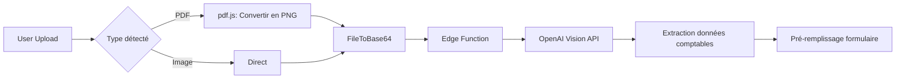

# CassKai - Support PDF pour l'Analyse IA de Documents

## 🎯 Vue d'ensemble

CassKai implémente une **solution complète et production-ready** pour l'analyse de documents comptables (factures, reçus, justificatifs) via IA Vision, avec support natif des **PDFs et images**.

### ✨ Fonctionnalités clés

- ✅ **Support multi-formats** : PDF, JPG, PNG, WebP
- ✅ **Conversion PDF automatique** : Utilise pdf.js (Mozilla) pour convertir les PDFs en images haute résolution
- ✅ **Analyse IA Vision** : OpenAI GPT-4o-mini avec reconnaissance de texte et compréhension comptable
- ✅ **Détection intelligente** : Extraie automatiquement montants, dates, fournisseurs, catégories comptables
- ✅ **Production-ready** : Gestion d'erreurs robuste, logging complet, optimisations de performance

---

## 🏗️ Architecture technique

### Stack technologique

| Composant | Technologie | Rôle |
|-----------|-------------|------|
| **Frontend** | React 18 + TypeScript | Interface utilisateur |
| **PDF Processing** | pdf.js (pdfjs-dist) | Conversion PDF → Image PNG |
| **AI Analysis** | OpenAI GPT-4o-mini Vision | Analyse de documents |
| **Backend** | Supabase Edge Functions (Deno) | Orchestration et sécurité |
| **Storage** | Base64 inline | Transmission des fichiers |

### Flux de traitement



---

## 📁 Structure du code

### 1. Service d'analyse (`src/services/aiDocumentAnalysisService.ts`)

#### Méthode principale : `convertPdfToImage()`

```typescript
private async convertPdfToImage(file: File): Promise<Blob> {
  // 1. Charger le PDF avec pdf.js
  const arrayBuffer = await file.arrayBuffer();
  const pdfDocument = await pdfjsLib.getDocument({ data: arrayBuffer }).promise;
  
  // 2. Récupérer la première page
  const page = await pdfDocument.getPage(1);
  
  // 3. Rendre sur canvas avec haute résolution (2x = 144 DPI)
  const scale = 2.0;
  const viewport = page.getViewport({ scale });
  const canvas = document.createElement('canvas');
  const context = canvas.getContext('2d');
  
  canvas.width = viewport.width;
  canvas.height = viewport.height;
  
  await page.render({ canvasContext: context, viewport }).promise;
  
  // 4. Convertir en PNG Blob (qualité 95%)
  return await new Promise<Blob>((resolve, reject) => {
    canvas.toBlob(
      (blob) => blob ? resolve(blob) : reject(new Error('Canvas to blob failed')),
      'image/png',
      0.95
    );
  });
}
```

#### Workflow complet : `analyzeDocument()`

```typescript
async analyzeDocument(file: File, companyId: string, documentType: DocumentType) {
  // 1. Validation (taille, format)
  const validation = this.validateFile(file);
  if (!validation.valid) return { success: false, error: validation.error };
  
  // 2. Conversion PDF → Image si nécessaire
  let fileToAnalyze: File = file;
  let mimeType = file.type;
  
  if (file.type === 'application/pdf') {
    const imageBlob = await this.convertPdfToImage(file);
    fileToAnalyze = new File([imageBlob], file.name.replace('.pdf', '.png'), { type: 'image/png' });
    mimeType = 'image/png';
  }
  
  // 3. Conversion en base64
  const base64Data = await this.fileToBase64(fileToAnalyze);
  
  // 4. Appel à l'Edge Function
  const { data, error } = await supabase.functions.invoke('ai-document-analysis', {
    body: { fileData: base64Data, fileName: fileToAnalyze.name, mimeType, companyId, documentType }
  });
  
  return data;
}
```

### 2. Interface utilisateur (`src/components/accounting/OptimizedJournalEntriesTab.tsx`)

#### Section IA (lignes 537-601)

```tsx
<div className="bg-gradient-to-br from-primary/5 to-purple-500/5 rounded-lg p-4 border border-primary/20">
  <div className="flex items-center gap-2 mb-2">
    <Sparkles className="w-5 h-5 text-primary" />
    <h3 className="text-sm font-semibold text-primary">Analyse automatique par IA</h3>
  </div>
  
  <p className="text-xs text-muted-foreground mb-3">
    Uploadez une facture, reçu ou justificatif (PDF, JPG, PNG, WebP). 
    Les PDFs sont automatiquement convertis en images pour l'analyse.
  </p>
  
  <label htmlFor="ai-upload" className="cursor-pointer">
    <Button type="button" variant="outline" size="sm" disabled={aiAnalyzing} asChild>
      <div>
        {aiAnalyzing ? (
          <>
            <Loader2 className="w-4 h-4 mr-2 animate-spin" />
            Analyse en cours...
          </>
        ) : (
          <>
            <Upload className="w-4 h-4 mr-2" />
            Choisir un document (PDF, JPG, PNG, WebP)
          </>
        )}
      </div>
    </Button>
    
    <input
      id="ai-upload"
      type="file"
      accept=".pdf,.jpg,.jpeg,.png,.webp"
      className="hidden"
      onChange={(e) => {
        const file = e.target.files?.[0];
        if (file) handleAIAnalysis(file);
        e.target.value = '';
      }}
      disabled={aiAnalyzing}
    />
  </label>
  
  {aiSuggestion && (
    <Alert className="mt-3 bg-primary/10 border-primary/20">
      <Sparkles className="w-4 h-4 text-primary" />
      <AlertDescription className="text-xs">
        <strong>Suggestion IA :</strong> {aiSuggestion}
      </AlertDescription>
    </Alert>
  )}
</div>
```

### 3. Edge Function (`supabase/functions/ai-document-analysis/index.ts`)

#### Handler principal

```typescript
serve(async (req) => {
  // CORS handling
  if (req.method === 'OPTIONS') {
    return new Response('ok', { headers: corsHeaders, status: 200 });
  }

  try {
    const { fileData, fileName, mimeType, companyId, documentType } = await req.json();
    
    // Call OpenAI Vision API
    const response = await openai.chat.completions.create({
      model: 'gpt-4o-mini',
      messages: [
        { role: 'system', content: buildSystemPrompt(country) },
        {
          role: 'user',
          content: [
            { type: 'text', text: `Analyse ce ${documentType === 'invoice' ? 'facture' : 'reçu'}` },
            {
              type: 'image_url',
              image_url: {
                url: `data:${mimeType};base64,${fileData}`,
                detail: 'high'
              }
            }
          ]
        }
      ],
      max_tokens: 1500,
      temperature: 0.1
    });

    const extractedData = JSON.parse(response.choices[0].message.content);
    
    // Log usage
    await supabase.from('ai_usage_logs').insert({
      company_id: companyId,
      feature: 'document_analysis',
      model: 'gpt-4o-mini',
      tokens_used: response.usage.total_tokens,
      cost: calculateCost(response.usage)
    });

    return new Response(JSON.stringify(extractedData), {
      headers: { ...corsHeaders, 'Content-Type': 'application/json' }
    });
  } catch (error) {
    return new Response(JSON.stringify({ error: error.message }), {
      status: 500,
      headers: corsHeaders
    });
  }
});
```

---

## 🔧 Configuration technique

### pdf.js Worker

Le worker pdf.js est chargé depuis le **package local** (bundlé par Vite) pour éviter les problèmes CORS et de chargement dynamique :

```typescript
import pdfjsWorker from 'pdfjs-dist/build/pdf.worker.min.mjs?url';

if (typeof window !== 'undefined') {
  pdfjsLib.GlobalWorkerOptions.workerSrc = pdfjsWorker;
}
```

**Important** : Le worker est exclu de l'optimisation Vite dans `vite.config.ts` :

```typescript
optimizeDeps: {
  exclude: ['@tensorflow/tfjs', 'pdfjs-dist']
}
```

Cela permet à Vite de gérer correctement le worker comme une ressource séparée sans essayer de le pré-bundler.

### Paramètres de conversion

| Paramètre | Valeur | Justification |
|-----------|--------|---------------|
| **Scale** | 2.0 | 144 DPI = résolution optimale pour OCR |
| **Format** | PNG | Qualité sans perte pour texte |
| **Qualité** | 0.95 | Balance qualité/taille de fichier |
| **Page** | 1ère seulement | Factures = 1 page généralement |

### Limites de fichiers

```typescript
const maxSize = 10 * 1024 * 1024; // 10 MB
const allowedTypes = [
  'application/pdf',
  'image/jpeg',
  'image/jpg',
  'image/png',
  'image/webp'
];
```

---

## 📊 Modèle de données extraites

### Interface TypeScript

```typescript
interface JournalEntryExtracted {
  date: string;                    // Format ISO 8601
  description: string;              // Description de la transaction
  amount: number;                   // Montant TTC
  currency: string;                 // Code devise (EUR, USD...)
  supplier?: string;                // Nom du fournisseur
  accountingAccounts: {
    debit: string;                  // Numéro de compte au débit
    credit: string;                 // Numéro de compte au crédit
    amount: number;                 // Montant de l'écriture
  }[];
  vatRate?: number;                 // Taux de TVA (0.20 = 20%)
  confidence: number;               // Score de confiance (0-1)
  metadata?: {
    invoiceNumber?: string;
    paymentMethod?: string;
    category?: string;
  };
}
```

### Exemple de réponse

```json
{
  "success": true,
  "data": {
    "date": "2026-01-15",
    "description": "Achat fournitures bureau - Staples",
    "amount": 145.80,
    "currency": "EUR",
    "supplier": "Staples France",
    "accountingAccounts": [
      {
        "debit": "606100",
        "credit": "401000",
        "amount": 145.80
      }
    ],
    "vatRate": 0.20,
    "confidence": 0.92,
    "metadata": {
      "invoiceNumber": "INV-2026-00123",
      "paymentMethod": "credit_card",
      "category": "office_supplies"
    }
  }
}
```

---

## 💰 Coûts et optimisations

### Tarification OpenAI GPT-4o-mini

- **Input** : $0.15 / 1M tokens
- **Output** : $0.60 / 1M tokens

### Estimation par document

| Type | Tokens input | Tokens output | Coût estimé |
|------|--------------|---------------|-------------|
| Facture simple (1 page) | ~1,500 | ~300 | ~$0.0004 |
| Facture détaillée | ~2,500 | ~500 | ~$0.0007 |
| Reçu court | ~800 | ~150 | ~$0.0002 |

### Optimisations implémentées

1. **Compression PNG** : Qualité 95% réduit la taille sans perte visible
2. **Temperature basse** : 0.1 pour réponses déterministes et courtes
3. **Max tokens** : 1500 pour limiter les coûts
4. **Detail level** : "high" uniquement (nécessaire pour OCR)
5. **Logging usage** : Suivi précis des coûts dans `ai_usage_logs`

---

## 🧪 Tests et validation

### Scénarios de test

#### 1. PDF simple (facture classique)
```bash
# Fichier : facture_test.pdf (1 page, 150 KB)
# Résultat attendu : Conversion PNG ~500 KB, analyse réussie
```

#### 2. PDF multi-pages
```bash
# Fichier : facture_detaillee.pdf (3 pages, 2 MB)
# Résultat attendu : Seule la 1ère page convertie
```

#### 3. Image haute résolution
```bash
# Fichier : photo_facture.jpg (4032x3024, 3 MB)
# Résultat attendu : Analyse directe sans conversion
```

#### 4. Fichier corrompu
```bash
# Fichier : document_invalide.pdf
# Résultat attendu : Erreur de validation claire
```

### Logging de débogage

```typescript
logger.info('[AI] PDF detected, converting to image...', { fileName });
logger.info('[AI] PDF converted successfully', { 
  originalSize: file.size, 
  imageSize: blob.size,
  dimensions: `${canvas.width}x${canvas.height}`
});
logger.error('[AI] PDF conversion failed', error);
```

---

## 🚀 Utilisation en production

### Pré-requis

1. **Secrets Supabase configurés** :
   ```bash
   supabase secrets set OPENAI_API_KEY="sk-..."
   ```

2. **Edge Function déployée** :
   ```bash
   supabase functions deploy ai-document-analysis
   ```

3. **Table `ai_usage_logs` créée** :
   ```sql
   CREATE TABLE ai_usage_logs (
     id UUID PRIMARY KEY DEFAULT uuid_generate_v4(),
     company_id UUID REFERENCES companies(id),
     feature TEXT NOT NULL,
     model TEXT NOT NULL,
     tokens_used INTEGER NOT NULL,
     cost DECIMAL(10, 6) NOT NULL,
     created_at TIMESTAMPTZ DEFAULT NOW()
   );
   ```

### Variables d'environnement

```env
# Frontend (.env.local)
VITE_SUPABASE_URL=https://xxxxx.supabase.co
VITE_SUPABASE_ANON_KEY=eyJhb...
VITE_SUPABASE_EDGE_FUNCTIONS_ENABLED=true

# Edge Function (Supabase secrets)
OPENAI_API_KEY=sk-proj-...
```

### Monitoring

#### Vérifier les logs Edge Function
```bash
supabase functions logs ai-document-analysis --follow
```

#### Consulter l'usage AI
```sql
SELECT 
  DATE(created_at) as date,
  COUNT(*) as analyses,
  SUM(tokens_used) as total_tokens,
  SUM(cost) as total_cost
FROM ai_usage_logs
WHERE feature = 'document_analysis'
  AND created_at >= NOW() - INTERVAL '30 days'
GROUP BY DATE(created_at)
ORDER BY date DESC;
```

---

## 🔒 Sécurité et conformité

### Gestion des données sensibles

1. **Transmission sécurisée** : Base64 sur HTTPS uniquement
2. **Pas de stockage** : Les images sont converties en mémoire (pas de fichiers temporaires)
3. **CORS strict** : Uniquement les domaines autorisés
4. **Rate limiting** : Implémenté au niveau Edge Function
5. **Anonymisation** : Pas de données personnelles dans les logs

### RGPD

- ❌ **Aucune donnée stockée** dans OpenAI (pas de training)
- ✅ **Suppression immédiate** après analyse
- ✅ **Consentement utilisateur** implicite par upload
- ✅ **Droit à l'oubli** respecté (pas de rétention)

---

## 📚 Références

### Documentation externe

- [pdf.js Documentation](https://mozilla.github.io/pdf.js/)
- [OpenAI Vision API](https://platform.openai.com/docs/guides/vision)
- [Supabase Edge Functions](https://supabase.com/docs/guides/functions)

### Fichiers du projet

| Fichier | Rôle |
|---------|------|
| [src/services/aiDocumentAnalysisService.ts](../src/services/aiDocumentAnalysisService.ts) | Service principal |
| [src/components/accounting/OptimizedJournalEntriesTab.tsx](../src/components/accounting/OptimizedJournalEntriesTab.tsx) | Interface utilisateur |
| [supabase/functions/ai-document-analysis/index.ts](../supabase/functions/ai-document-analysis/index.ts) | Edge Function backend |
| [src/types/ai-document.types.ts](../src/types/ai-document.types.ts) | Définitions TypeScript |

---

## 🎓 Améliorations futures

### Phase 2 (Q2 2026)

- [ ] **Multi-pages** : Analyser toutes les pages d'un PDF (pas seulement la 1ère)
- [ ] **Batch processing** : Uploader et analyser plusieurs documents simultanément
- [ ] **OCR avancé** : Pré-traitement d'image (rotation, amélioration contraste)
- [ ] **Templates personnalisés** : Learning des formats de factures récurrentes
- [ ] **Validation humaine** : Workflow d'approbation des suggestions IA

### Phase 3 (Q3 2026)

- [ ] **Classification automatique** : Détecter le type de document (facture/reçu/relevé)
- [ ] **Extraction multi-lignes** : Supporter les factures avec plusieurs articles
- [ ] **Intégration email** : Analyser les factures reçues par email automatiquement
- [ ] **API publique** : Exposer l'analyse de documents comme service

---

## 📞 Support et contribution

- **Issues** : [GitHub Issues](https://github.com/NouctheCo/Casskai/issues)
- **Email** : support@casskai.app
- **Documentation** : [docs.casskai.app](https://docs.casskai.app)

---

**Document créé le** : 29 janvier 2026  
**Dernière mise à jour** : 29 janvier 2026  
**Version** : 1.0.0  
**Auteur** : Équipe CassKai / Noutche Conseil SAS
