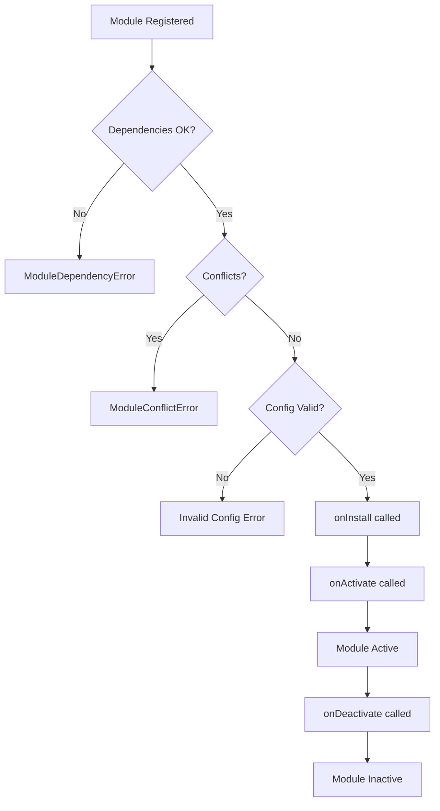

# ModuleManager - Gestionnaire de Modules CassKai

## Vue d'ensemble

Le `ModuleManager` est le service central qui gère l'activation, la désactivation et la configuration des modules dans CassKai. Il implémente un système modulaire complet avec gestion des dépendances, validation des conflits et persistance multi-tenant.

## Architecture

```typescript
ModuleManager (Singleton)
├── Module Registry (Map<string, Module>)
├── Activations (Map<string, ModuleActivation>)  
├── Dependencies (Map<string, string[]>)
├── Tenant Management
└── Permission System
```

## Fonctionnalités Principales

### 1. Gestion des Modules

#### Enregistrement d'un module
```typescript
const moduleManager = ModuleManager.getInstance();

// Définition d'un module
const myModule: Module = {
  definition: {
    id: 'my-module',
    name: 'Mon Module',
    version: '1.0.0',
    category: 'productivity',
    dependencies: ['core-module'],
    conflicts: ['incompatible-module'],
    isCore: false
  },
  onInstall: async (context) => {
    // Logique d'installation
    console.log('Module installé pour tenant:', context.tenantId);
  },
  onActivate: async (context) => {
    // Logique d'activation
    console.log('Module activé avec config:', context.config);
  },
  onDeactivate: async (context) => {
    // Logique de désactivation
  },
  validateConfig: (config) => {
    // Validation de la configuration
    return config.apiKey ? true : 'apiKey is required';
  }
};

moduleManager.registerModule(myModule);
```

#### Activation d'un module
```typescript
try {
  await moduleManager.activateModule(
    'my-module', 
    'user-123', 
    { 
      apiKey: 'secret-key',
      enableFeature: true 
    }
  );
  console.log('Module activé avec succès');
} catch (error) {
  if (error instanceof ModuleError) {
    console.error('Erreur module:', error.code, error.message);
  }
}
```

### 2. Gestion des Dépendances

Le ModuleManager vérifie automatiquement les dépendances et active les modules requis:

```typescript
// Module A dépend de Module B
const moduleA: Module = {
  definition: {
    id: 'module-a',
    name: 'Module A',
    version: '1.0.0',
    category: 'feature',
    dependencies: ['module-b'] // ← Dépendance
  },
  // ...
};

// Lors de l'activation de Module A:
// 1. Vérification de la disponibilité de Module B
// 2. Activation automatique de Module B si nécessaire
// 3. Activation de Module A
```

### 3. Gestion des Conflits

```typescript
// Modules incompatibles
const moduleX: Module = {
  definition: {
    id: 'module-x',
    conflicts: ['module-y'] // ← Conflit déclaré
  }
};

// Tentative d'activation simultanée → ModuleConflictError
```

### 4. Multi-tenant

```typescript
// Initialisation avec tenant spécifique
await moduleManager.initialize({
  tenantId: 'company-uuid-123',
  permissions: ['module:activate', 'module:configure']
});

// Les activations sont isolées par tenant
// tenant A: [module-1, module-2]  
// tenant B: [module-2, module-3]
```

## Cycle de Vie des Modules



## API Référence

### Méthodes Principales

#### `initialize(context: Partial<ModuleContext>): Promise<void>`
Initialise le gestionnaire avec le contexte tenant.

**Paramètres:**
- `context.tenantId`: ID unique du tenant (UUID requis)
- `context.permissions`: Permissions de l'utilisateur

**Erreurs:**
- `ModuleError('INVALID_TENANT_ID')` si tenantId invalide

#### `activateModule(moduleId, userId, config): Promise<void>`
Active un module avec la configuration fournie.

**Paramètres:**
- `moduleId`: Identifiant du module
- `userId`: ID de l'utilisateur effectuant l'activation  
- `config`: Configuration du module

**Erreurs:**
- `ModuleError('MODULE_NOT_FOUND')`
- `ModuleError('ALREADY_ACTIVE')`
- `ModuleDependencyError` 
- `ModuleConflictError`
- `ModuleError('INVALID_CONFIG')`

#### `deactivateModule(moduleId, userId): Promise<void>`
Désactive un module.

**Vérifications:**
- Aucun module actif ne dépend de celui-ci
- Module actuellement actif

#### `getAvailableModules(): ModuleDefinition[]`
Retourne tous les modules enregistrés.

#### `getActiveModules(): ModuleDefinition[]` 
Retourne les modules actuellement actifs.

#### `isModuleActive(moduleId): boolean`
Vérifie si un module est actif.

#### `getModuleConfig(moduleId): Record<string, unknown> | null`
Retourne la configuration d'un module actif.

### Méthodes de Debug

#### `getDebugInfo(): Record<string, unknown>`
```typescript
const debug = moduleManager.getDebugInfo();
console.log({
  isInitialized: debug.isInitialized,
  totalModules: debug.totalModules, 
  activeModules: debug.activeModules,
  registeredModules: debug.registeredModules,
  activeModuleIds: debug.activeModuleIds
});
```

## Persistance des Données

### Stratégie de Sauvegarde

1. **Base de données principale** (Supabase)
   ```sql
   -- Table companies
   id UUID PRIMARY KEY
   active_modules JSONB -- {"module-1": true, "module-2": false}
   ```

2. **Fallback localStorage**
   ```javascript
   // Clé: casskai-modules-{tenantId}
   // Valeur: ModuleActivation[]
   ```

### Gestion des Erreurs de Persistance

```typescript
// Erreur UUID → Fallback localStorage automatique
// Erreur réseau → Retry avec localStorage backup
// Incohérence → Réconciliation au prochain démarrage
```

## Types de Données

### ModuleDefinition
```typescript
interface ModuleDefinition {
  id: string;                    // Identifiant unique
  name: string;                  // Nom affiché
  version: string;               // Version semver  
  category: ModuleCategory;      // Catégorie du module
  description?: string;          // Description
  dependencies: string[];        // Modules requis
  conflicts?: string[];          // Modules incompatibles
  isCore?: boolean;             // Module système
  isPremium?: boolean;          // Module payant
  status?: ModuleStatus;        // État du module
}
```

### ModuleActivation
```typescript
interface ModuleActivation {
  moduleId: string;             // ID du module
  isActive: boolean;            // État d'activation
  activatedAt: Date;            // Date d'activation
  activatedBy: string;          // Utilisateur activateur
  configuration: Record<string, unknown>; // Config du module
}
```

### ModuleContext
```typescript
interface ModuleContext {
  moduleId: string;             // Module courant
  userId: string;               // Utilisateur courant
  tenantId: string;             // Tenant courant
  permissions: string[];        // Permissions utilisateur
  config: Record<string, unknown>; // Configuration
  services: {                   // Services disponibles
    database: DatabaseService;
    storage: StorageService;
    notifications: NotificationService;
    integrations: IntegrationService;
    analytics: AnalyticsService;
    ai: AIService;
  };
}
```

## Gestion des Erreurs

### Types d'Erreurs

```typescript
// Erreur générique de module
class ModuleError extends Error {
  constructor(
    message: string,
    public moduleId: string, 
    public code: ModuleErrorCode,
    public context?: Record<string, unknown>
  ) {
    super(message);
    this.name = 'ModuleError';
    this.timestamp = new Date().toISOString();
  }
}

// Erreur de dépendance
class ModuleDependencyError extends Error {
  constructor(
    public moduleId: string,
    public missingDependencies: string[]
  ) {
    super(`Missing dependencies for ${moduleId}: ${missingDependencies.join(', ')}`);
  }
}

// Erreur de conflit
class ModuleConflictError extends Error {
  constructor(
    public moduleId: string,
    public conflictingModules: string[]
  ) {
    super(`Module ${moduleId} conflicts with: ${conflictingModules.join(', ')}`);
  }
}
```

### Codes d'Erreur
```typescript
type ModuleErrorCode = 
  | 'INVALID_TENANT_ID'
  | 'MODULE_NOT_FOUND' 
  | 'ALREADY_ACTIVE'
  | 'NOT_ACTIVE'
  | 'INVALID_CONFIG'
  | 'ACTIVATION_FAILED'
  | 'DEACTIVATION_FAILED'
  | 'HAS_ACTIVE_DEPENDENTS'
  | 'DUPLICATE_REGISTRATION'
  | 'INVALID_DEFINITION'
  | 'INVALID_VERSION';
```

## Système de Permissions

Le `ModulePermissionService` gère les permissions granulaires:

```typescript
// Permissions disponibles
const PERMISSIONS = {
  // Générales
  MODULE_ACTIVATE: 'module:activate',
  MODULE_CONFIGURE: 'module:configure',
  
  // Spécifiques aux modules
  CRM_MANAGE_CONTACTS: 'crm:manage_contacts',
  HR_APPROVE_LEAVES: 'hr:approve_leaves',
  PROJECT_BILLING: 'project:billing'
};

// Vérification des permissions
const hasPermission = ModulePermissionService.hasPermission(
  userPermissions, 
  PERMISSIONS.MODULE_ACTIVATE
);
```

## Exemples d'Usage

### Module CRM Complet
```typescript
const crmModule: Module = {
  definition: {
    id: 'crm',
    name: 'Gestion Relation Client', 
    version: '2.1.0',
    category: 'business',
    dependencies: ['core', 'contacts'],
    isPremium: true
  },
  
  onInstall: async (context) => {
    // Créer les tables CRM
    await context.services.database.createTables([
      'crm_contacts', 'crm_deals', 'crm_activities'
    ]);
  },
  
  onActivate: async (context) => {
    // Initialiser les services CRM
    await context.services.integrations.setupEmailSync(context.config.emailProvider);
    
    // Démarrer la synchronisation
    await context.services.analytics.trackEvent('crm_activated', {
      tenantId: context.tenantId,
      features: Object.keys(context.config)
    });
  },
  
  onDeactivate: async (context) => {
    // Nettoyer les ressources
    await context.services.integrations.stopEmailSync();
  },
  
  validateConfig: (config) => {
    if (!config.emailProvider) {
      return 'Email provider is required for CRM module';
    }
    if (!config.pipelineStages || config.pipelineStages.length === 0) {
      return 'At least one pipeline stage is required';  
    }
    return true;
  }
};

// Activation avec configuration complète
await moduleManager.activateModule('crm', 'user-456', {
  emailProvider: 'gmail',
  pipelineStages: ['lead', 'qualified', 'proposal', 'won', 'lost'],
  autoAssignment: true,
  notifications: {
    newLeads: true,
    dealUpdates: true
  }
});
```

### Gestion des Modules Core
```typescript
// Modules core activés automatiquement à l'initialisation
const coreModules = [
  'authentication',
  'user-management', 
  'company-settings',
  'audit-log'
];

// Activation automatique lors de l'initialisation
await moduleManager.initialize({
  tenantId: companyId,
  permissions: ['*'] // Admin
});

// Les modules core sont maintenant actifs
console.log(moduleManager.getActiveModules().filter(m => m.isCore));
```

## Bonnes Pratiques

### 1. Définition des Modules
- **ID unique**: Utiliser un format cohérent (`category-feature`)
- **Versioning**: Respecter le semantic versioning
- **Dépendances**: Minimiser les dépendances, déclarer explicitement
- **Configuration**: Valider rigoureusement les paramètres

### 2. Gestion des Erreurs  
- **Logging**: Utiliser les niveaux appropriés (warn/error)
- **Recovery**: Implémenter des fallbacks quand possible
- **User Experience**: Messages d'erreur compréhensibles

### 3. Performance
- **Lazy Loading**: Charger les modules à la demande
- **Caching**: Mettre en cache les configurations fréquemment utilisées
- **Batching**: Activer plusieurs modules en parallèle si possible

### 4. Sécurité
- **Permissions**: Vérifier les permissions avant chaque opération
- **Validation**: Valider toutes les entrées utilisateur
- **Audit**: Logger les activations/désactivations

## Dépannage

### Problèmes Courants

#### "tenantId invalide ou manquant"
```typescript
// Vérifier le format UUID
const isValidUUID = /^[0-9a-f]{8}-[0-9a-f]{4}-4[0-9a-f]{3}-[89ab][0-9a-f]{3}-[0-9a-f]{12}$/i;
console.log('Valid UUID:', isValidUUID.test(tenantId));
```

#### "Module already registered"
```typescript
// Vérifier l'état du registry
const debug = moduleManager.getDebugInfo();
console.log('Registered modules:', debug.registeredModules);
```

#### "Missing dependencies"  
```typescript
// Activer les dépendances manuellement
for (const dep of ['dep1', 'dep2']) {
  if (!moduleManager.isModuleActive(dep)) {
    await moduleManager.activateModule(dep, userId, {});
  }
}
```

### Logs de Debug
```typescript
// Activer le debug en développement
if (import.meta.env.DEV) {
  console.warn('[ModuleManager] Debug info:', moduleManager.getDebugInfo());
}
```